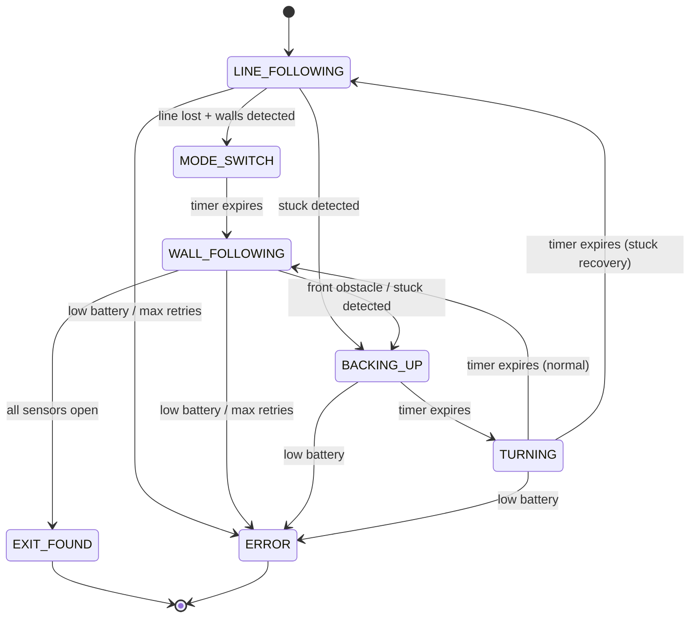

# MazeRobot

Autonomous maze-solving robot for Arduino Mega using IR and ultrasonic sensors with PID control.

## State Machine

The robot is driven by a non-blocking finite state machine. The `loop()` function never blocks; all timed actions (turns, pauses, mode-switch delays) use `millis()`-based `Timer` structs so that sensors continue to be read and the battery continues to be checked even during multi-step maneuvers. Each state returns from `loop()` quickly (target < 50 ms), and transitions happen by setting `currentState` to a new value that takes effect on the next iteration.

## Loop Execution Flow

Each iteration of `loop()` follows these steps:

1. **Check battery** -- read the voltage divider on A4 and enter `ERROR_STATE` if the average reading falls below `VOLTAGE_THRESHOLD`.
2. **Read all sensors** -- sample the 4 IR reflectance sensors (`readIRSensors()`) and one ultrasonic sensor per cycle with EMA filtering (`readUltrasonicSensors()`).
3. **Check stuck** -- if in `LINE_FOLLOWING` or `WALL_FOLLOWING`, compare current filtered distances against a stored snapshot. If nothing has changed by more than 2.0 cm for 3000 ms, trigger recovery or escalate to `ERROR_STATE`.
4. **Execute current state's logic** -- a `switch` on `currentState` dispatches to the appropriate handler (e.g., `followLine()`, `followWall()`, timer checks).
5. **State logic may change `currentState`** -- any handler can set `currentState` to a new value, which takes effect on the next iteration.

## Stuck Detection & Recovery

The stuck-detection watchdog monitors the robot using three independent signals:

1. **Ultrasonic stagnation** -- during `LINE_FOLLOWING` and `WALL_FOLLOWING`, a snapshot of the `distFiltered[]` array is captured at watchdog start and whenever the robot re-enters a monitored state from a non-monitored state (e.g. returning to `WALL_FOLLOWING` after a turn). Each loop iteration, the watchdog compares current filtered distances against the snapshot. If no sensor value has changed by more than 2.0 cm for a continuous 3000 ms window, the robot is declared stuck.
2. **PID-output saturation** -- during `LINE_FOLLOWING` and `WALL_FOLLOWING`, the watchdog tracks how long the PID control output stays within `STUCK_PID_THRESHOLD` of its +/- limit. Sustained saturation for 3000 ms indicates the robot is pushing against an obstacle it cannot overcome. The saturation timer resets whenever ultrasonic movement is detected.
3. **Turn timeout** -- during `STATE_TURNING`, if a turn exceeds `TURN_TIMEOUT_MS` the robot is assumed physically unable to complete the rotation.

Recovery is handled by `startBackupAndTurn()`. The turn direction alternates with each retry: odd-numbered retries turn left, even-numbered retries turn right. This prevents the robot from repeating the same failed escape path. A retry counter tracks the number of recovery attempts within a 5000 ms cooldown window.

If the retry counter reaches 2 without the robot making meaningful progress, the watchdog escalates to `ERROR_STATE` and the robot stops permanently (requiring a hardware reset).

The distance snapshot and PID saturation timer are captured fresh whenever the robot transitions into `LINE_FOLLOWING` or `WALL_FOLLOWING` from a state where stuck detection is not active. This prevents false positives during turns and backup maneuvers, where the robot is intentionally moving but the filtered distances may not change significantly.

## File Layout

`MazeRobot/MazeRobot.ino` is organized into 13 sequential sections:

| Section | Name | Description |
| ------- | ---- | ----------- |
| 1 | Debug Toggle | Compile-time debug output control |
| 2 | Pin Assignments | Hardware pin definitions |
| 3 | Calibration Constants | Tunable parameters (motor, sensor, PID, stuck detection) |
| 4 | Type Definitions | `PIDController`, `Motor`, `Timer` structs |
| 5 | State Machine | State enum and `TurnDir` enum |
| 6 | Global Instances | Motors, sensors, PID controllers, state variables |
| 7 | Drive Helpers | Motor control functions (tank drive, brake, turn) |
| 8 | Sensor Functions | IR and ultrasonic sensor reading |
| 9 | Line Following | PID-based line tracking |
| 10 | Wall Following | PID-based wall tracking with junction detection |
| 11 | State Transitions | Mode switching and exit detection |
| 12 | Error / Battery / Stuck Handling | Safety systems and stuck watchdog |
| 13 | Setup & Main Loop | Initialization and state machine dispatch |
